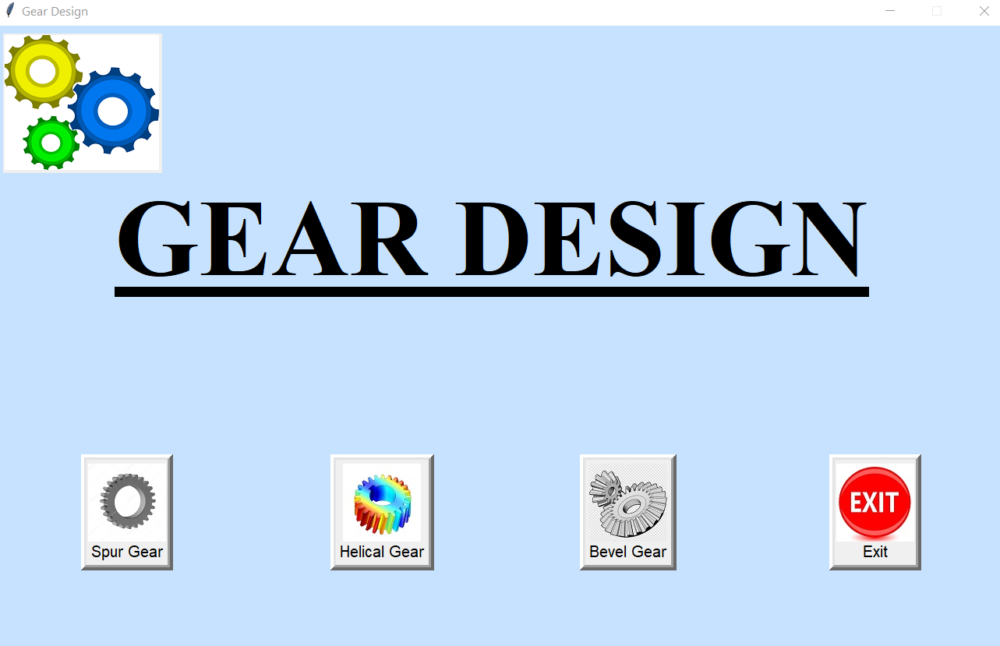
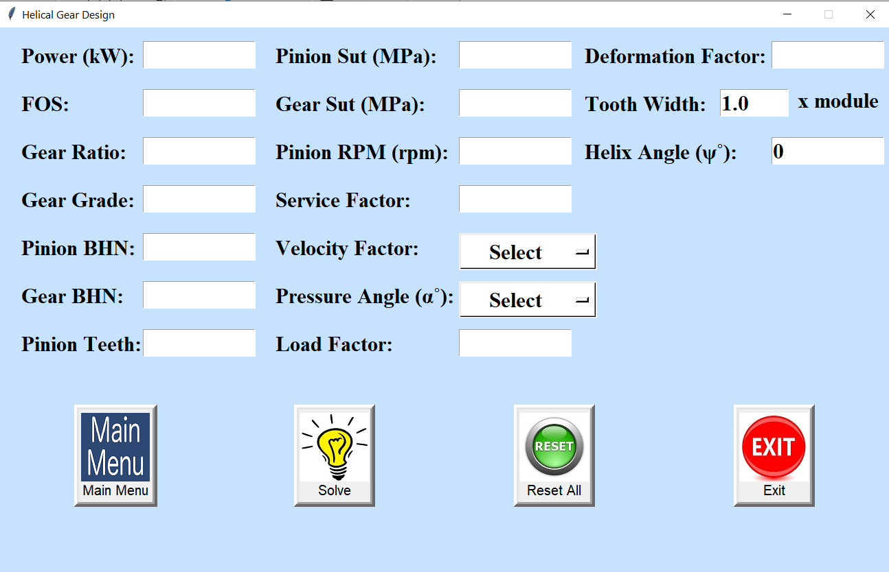
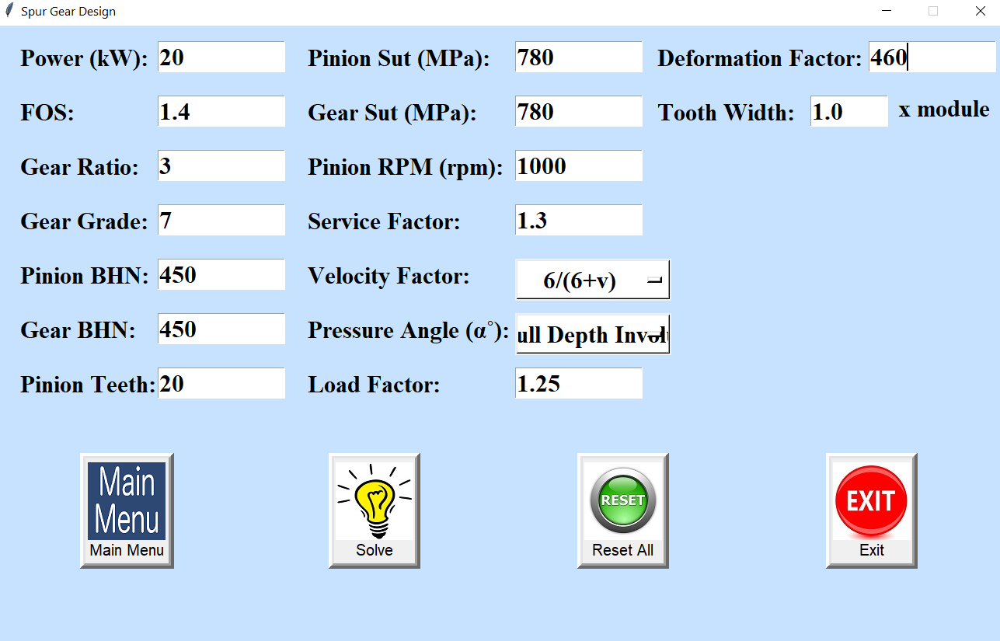
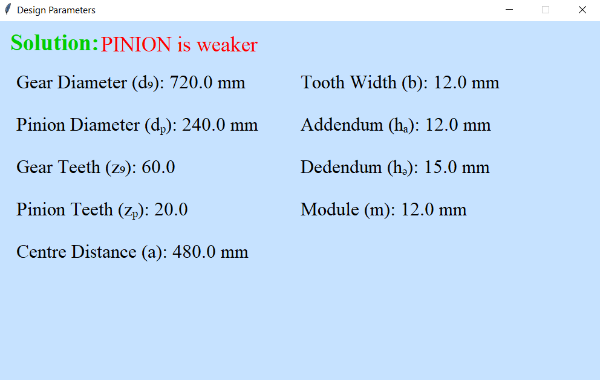

# Gear-Design-Software

When designing a mechanical element for a certain application, it's crucial to choose the right values for the design parameters. This technique sometimes can be complicated and time-consuming to follow.
This repository offers Python implementation code for designing mechanical gears for various applications using a GUI-based desktop application.
This application calculates the gear parameters after estimating the appropriate module for the given input parameters.

Currently, it supports solving complex calculations for following types of gears:
* Spur
* Helical
* Bevel

⚙️⚙️⚙️⚙️⚙️⚙️⚙️⚙️⚙️⚙️⚙️⚙️⚙️⚙️⚙️⚙️⚙️⚙️⚙️⚙️⚙️⚙️⚙️⚙️⚙️⚙️⚙️⚙️⚙️⚙️⚙️⚙️⚙️⚙️⚙️⚙️⚙️⚙️⚙️⚙️⚙️⚙️⚙️⚙️⚙️⚙️⚙️⚙️⚙️⚙️⚙️⚙️⚙️⚙️⚙️⚙️⚙️⚙️⚙️⚙️
## Table of Contents
* [System Requirements](#system-requirements)
* [Installation and Setup](#installation-and-setup)
* [Usage](#usage)
* [Output](#output)


## System Requirements
* Windows, Linux or Mac OS
* Python 3.6 or above

## Installation and Setup
* Install dependencies using [requirements.txt](requirements.txt)
```
    pip install -r requirements.txt
```

## Usage
* Run [main_page.py](main_page.py) as follows:
```
    python3 main_page.py
```

## Output
### Main Page



### Gear Input Param Page



### Example Input Parameters



### Result Page


